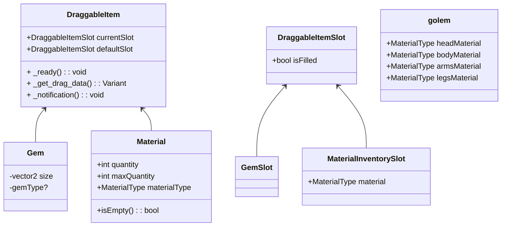

```mermaid
classDiagram
    DraggableItem <-- Gem
    DraggableItem <-- Material

    class DraggableItem{
        +DraggableItemSlot currentSlot
        +DraggableItemSlot defaultSlot

        + _ready(): void 
        + _get_drag_data(): Variant
        + _notification(): void
    }
    class Gem{
        -vector2 size
        -gemType?
    }
    class Material{
        +int quantity
        +int maxQuantity
        +MaterialType materialType
        +isEmpty(): bool
    }


    DraggableItemSlot <-- GemSlot
    DraggableItemSlot <-- MaterialInventorySlot

    class DraggableItemSlot{
        +bool isFilled
    }
    class GemSlot{
    }
    class MaterialInventorySlot{
        +MaterialType material
    }

    class golem{
        +MaterialType headMaterial
        +MaterialType bodyMaterial
        +MaterialType armsMaterial
        +MaterialType legsMaterial

    }
```