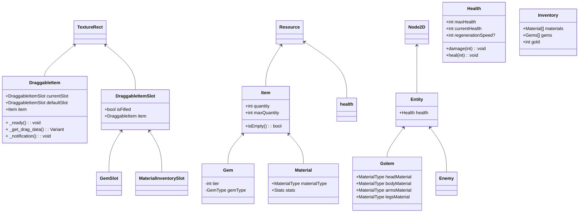

```mermaid
classDiagram
    
    TextureRect <-- DraggableItem
    class DraggableItem{
        +DraggableItemSlot currentSlot
        +DraggableItemSlot defaultSlot
        +Item item

        + _ready(): void 
        + _get_drag_data(): Variant
        + _notification(): void
    }

    Resource <-- Item
    Item <-- Gem
    Item <-- Material
    class Item{
        +int quantity
        +int maxQuantity
        +isEmpty(): bool
    }
    class Gem{
        -int tier
        -GemType gemType
    }
    class Material{
        +MaterialType materialType
        +Stats stats
    }

    TextureRect <-- DraggableItemSlot
    DraggableItemSlot <-- GemSlot
    DraggableItemSlot <-- MaterialInventorySlot

    class DraggableItemSlot{
        +bool isFilled
        +DraggableItem item
    }

    Node2D <-- Entity
    Entity <-- Golem
    Entity <-- Enemy
    class Entity{
        +Health health
    }
    class Golem{
        +MaterialType headMaterial
        +MaterialType bodyMaterial
        +MaterialType armsMaterial
        +MaterialType legsMaterial
    }
    class Enemy{

    }

    Resource <-- health
    class Health{
        +int maxHealth
        +int currentHealth
        +int regenerationSpeed?
        +damage(int):void
        +heal(int):void
    }

    class Inventory{
        +Material[] materials
        +Gems[] gems
        +int gold
    }
```