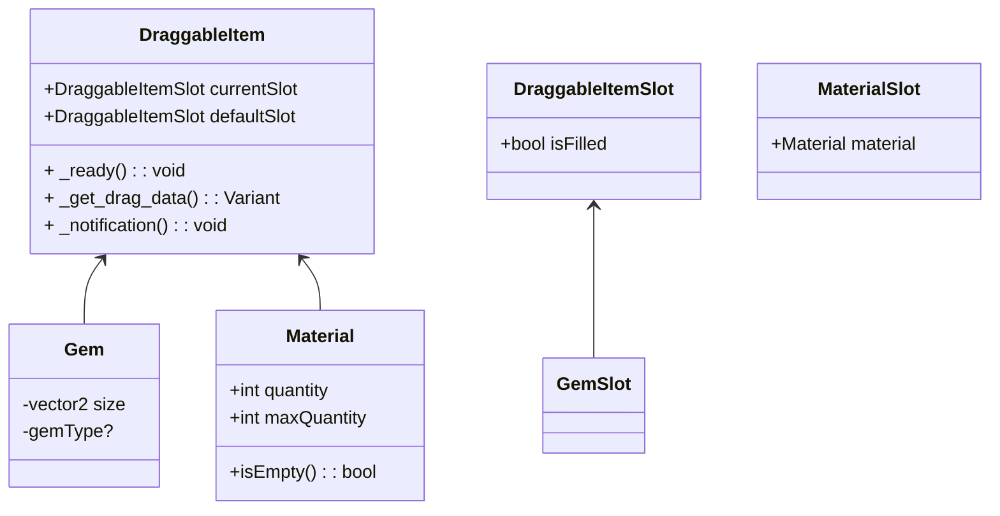

```mermaid
classDiagram
    DraggableItem <-- Gem
    DraggableItem <-- Material

    class DraggableItem{
        +DraggableItemSlot currentSlot
        +DraggableItemSlot defaultSlot

        + _ready(): void 
        + _get_drag_data(): Variant
        + _notification(): void
    }
    class Gem{
        -vector2 size
        -gemType?
    }
    class Material{
        +int quantity
        +int maxQuantity
        +isEmpty(): bool
    }

    DraggableItemSlot <-- GemSlot

    class DraggableItemSlot{
        +bool isFilled
    }
    class GemSlot{
    }
    class MaterialSlot{
        +Material material
    }
```